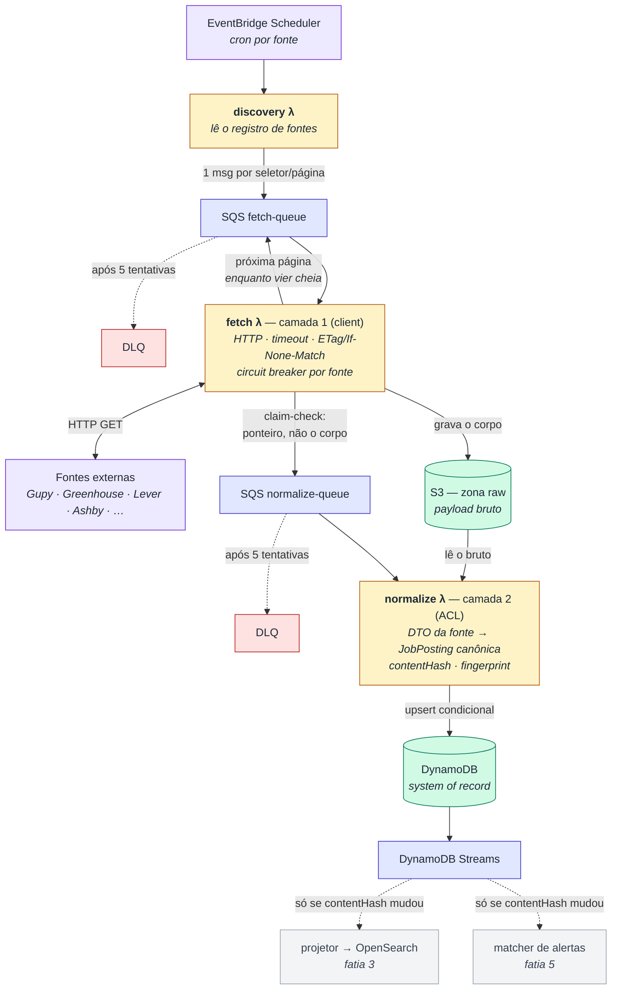

# Job Radar

Agregador de vagas serverless em Node.js/TypeScript sobre AWS (Lambda + SQS +
DynamoDB + S3), com ports & adapters para múltiplas fontes.

> **Estado:** fatia vertical 1 de 6 entregue — o pipeline de ingestão completo,
> com o Gupy como primeira fonte, rodando de ponta a ponta.

---

## A premissa que orienta o projeto

Vagas sérias não se pegam raspando HTML. Todo ATS grande — Greenhouse, Lever,
Ashby, Workable, SmartRecruiters — publica uma **API JSON pública e sem
autenticação** para as empresas embutirem o board no próprio site. É de lá que
os agregadores profissionais tiram os dados: sem anti-bot, sem proxy, sem
parser de DOM quebrando toda semana.

Isso inverte onde está o trabalho difícil. Buscar é fácil. O que custa é
**normalizar, deduplicar e detectar mudança e expiração** entre fontes com
formatos completamente diferentes — e é para isso que a arquitetura foi
desenhada.

### Fontes mapeadas (endpoints validados ao vivo)

| Fonte | Endpoint | Situação |
|---|---|---|
| **Gupy (BR)** | `employability-portal.gupy.io/api/v1/jobs?jobName=…&offset=&limit=` | ✅ implementada |
| Greenhouse | `api.greenhouse.io/v1/boards/{slug}/jobs?content=true` | planejada (fatia 2) |
| Ashby | `api.ashbyhq.com/posting-api/job-board/{slug}` | planejada (fatia 2) |
| Lever | `api.lever.co/v0/postings/{slug}?mode=json&skip=&limit=` | planejada (fatia 2) |
| Workable | `apply.workable.com/api/v1/widget/accounts/{slug}` | planejada (fatia 2) |
| SmartRecruiters | `api.smartrecruiters.com/v1/companies/{slug}/postings` | planejada (fatia 2) |
| Remotive · RemoteOK · Arbeitnow · Jobicy · Himalayas · WeWorkRemotely | feeds JSON/RSS abertos | planejadas (fatia 4) |

Armadilhas descobertas na validação, hoje cobertas por teste:

- O Gupy **só** aceita `jobName=` ou `term=`. Mandar `name=` devolve HTTP 400.
- **`pagination.total` do Gupy mente.** Com `limit=10` reporta o total real
  (582 para "desenvolvedor"); com `limit>=50` reporta 100 — enquanto os offsets
  0/100/200 devolvem 100 itens distintos cada. Paginar por `total` pararia na
  primeira página e perderia ~480 vagas **em silêncio**. A paginação aqui
  continua enquanto a página vem cheia.
- Lever e SmartRecruiters devolvem **200 com lista vazia** para slug
  inexistente — "0 vagas" não distingue empresa sem vaga de slug errado.
- O primeiro item do array do RemoteOK é um aviso legal, **não é uma vaga**. E
  os termos exigem backlink `dofollow`, sob pena de suspensão do acesso.

---

## Arquitetura



Duas arestas do diagrama carregam as decisões menos óbvias do pipeline. A que
**volta** de `fetch λ` para a própria fila é a paginação: ela se resolve no
fetch, não no discovery, porque nenhuma das fontes diz quantas páginas existem
antes da primeira resposta. E o desvio pelo **S3 entre fetch e normalize** é o
claim-check: o corpo não trafega pela fila, só o ponteiro.

### Decisões que valem explicar

**Por que claim-check.** A resposta do board do Stripe no Greenhouse tem ~4 MB;
o limite de mensagem do SQS é 256 KB. O corpo não cabe na fila. Como efeito
colateral, ganhamos replay: um parser corrigido reprocessa meses de histórico
sem bater na fonte de novo — e para vaga de emprego, o dado antigo não existe
mais na origem.

**Por que `fetch` e `parse` são métodos separados da mesma porta.** `fetch` faz
I/O; `parse` é uma função pura sobre o payload bruto. Isso é o que permite
testar todo parser contra fixtures gravadas da fonte real. *Parser drift* — a
fonte muda o JSON e o pipeline degrada calado — é o modo de falha número um de
um agregador, e é `parse` que os testes atacam.

**Os três identificadores de uma vaga**, cada um resolvendo um problema:

| | o que é | para quê |
|---|---|---|
| `id` | `sha256(fonte + idExterno)` | idempotência: reprocessar nunca duplica |
| `contentHash` | `sha256(título+descrição+local+salário)` | detectar mudança real |
| `fingerprint` | empresa+título+local normalizados | mesma vaga em fontes diferentes |

O `contentHash` é o curto-circuito mais valioso do sistema: numa atualização
diária, ~98% das vagas não mudam e não precisam ser reindexadas nem casadas
com alertas. O `fingerprint` é deliberadamente aproximado — agrupa na leitura,
**nunca destrói** um dos lados.

**Expiração.** As fontes simplesmente somem com a vaga. Cada rodada tem um
`runId`; o sweeper marca como `EXPIRED` o que a fonte não devolveu — mas só se
a rodada teve 100% de sucesso. Sem essa guarda, uma instabilidade da fonte
expira o catálogo inteiro.

**Storage: DynamoDB + OpenSearch Serverless.** DynamoDB é certo para a escrita
(upsert por chave, alta cardinalidade, sem join), mas não faz full-text nem
facetas combináveis — a API de busca viraria `Scan` com filtro. O índice de
leitura vai para uma coleção **NextGen** do OpenSearch Serverless, que escala a
zero e não tem mínimo de OCU (a coleção clássica cobra ~$350/mês parada). O
índice é descartável e reconstruível a partir do DynamoDB.

**Sem NestJS.** As convenções do projeto são as de NestJS — ports & adapters,
cliente + ACL em duas camadas, `Result<T, E>`, `BusinessError` com tipo
semântico. O framework não: em Lambda, montar um container de DI a cada cold
start é custo puro, e não há nada neste grafo que a construção explícita não
resolva.

### Layout

```
packages/core/         domínio puro — ZERO AWS, zero framework, zero Zod
  contexts/ingestion/  domain/{entities,value-objects,ports} + use-cases/
  commons/             Result, BusinessError, ErrorType
packages/adapters/     clients (camada 1) + ACLs (camada 2) por fonte
packages/infra-aws/    DynamoDB, S3, SQS — implementam as ports do core
apps/ingestion/        handlers Lambda + composition root
infra/                 stack CDK
fixtures/              payloads reais gravados, por fonte
```

A direção de dependência aponta para dentro: `handlers → use-cases → domain`, e
`infra-aws → domain` (invertida por DIP). O domínio não importa nada.

---

## Rodando

```bash
pnpm install
pnpm test          # 42 testes: parsers contra fixtures + domínio sem infra
pnpm typecheck
pnpm lint
```

### Pipeline completo, sem nenhuma AWS

```bash
pnpm pipeline:local desenvolvedor 3
```

Roda discovery → fetch → normalize contra a **API real do Gupy**, usando ports
em memória. Saída de uma execução real:

```
[rodada 1] fetch p0 {"status":"stored","hasNextPage":true}
[rodada 1] fetch p1 {"status":"stored","hasNextPage":true}
[rodada 1] fetch p2 {"status":"stored","hasNextPage":true}
[rodada 1] normalização {"parsed":300,"created":300,"updated":0,"unchanged":0}
[rodada 2] normalização {"parsed":300,"created":0,"updated":0,"unchanged":300}
OK: contentHash curto-circuitou a 2a rodada
```

A segunda rodada cair inteira em `unchanged` é o teste de saúde do sistema: se
não cair, ou entrou algo não-determinístico no `contentHash`, ou a fonte
reescreve o conteúdo a cada requisição.

Que esse comando seja possível é, por si só, o teste da arquitetura — o
pipeline não sabe que a AWS existe.

### Com infra local

```bash
docker compose up -d      # DynamoDB Local + LocalStack (S3/SQS) + OpenSearch
cp .env.example .env
```

### Deploy

```bash
cd infra
npx cdk synth --context stage=dev
npx cdk deploy --context stage=dev
```

Depois, cadastre uma fonte no registro (é um `PutItem` — nunca um deploy):

```json
{
  "pk": "SOURCES",
  "sk": "gupy#backend",
  "sourceId": "gupy",
  "selector": "backend",
  "enabled": true,
  "params": {}
}
```

---

## Roadmap

1. ✅ **Fatia vertical com uma fonte (Gupy)** — domínio, ports, adapter em duas
   camadas, pipeline completo, CDK, fixtures e testes.
2. Adapters de ATS (Greenhouse, Lever, Ashby, Workable, SmartRecruiters) +
   sweeper de expiração.
3. Projetor do OpenSearch + API REST de busca.
4. Agregadores remotos + tratamento de atribuição (o backlink do RemoteOK é
   requisito de ToS, não detalhe).
5. Perfis de alerta + matcher + notificador.
6. Adapter de browser, atrás de feature flag, **desligado por padrão**.

### Sobre a fatia 6

Raspar LinkedIn, Indeed e Glassdoor viola os Termos de Uso desses sites, e o
LinkedIn em particular litiga e mantém anti-bot agressivo — na prática exige
rotação de proxy residencial e quebra com frequência. O adapter está previsto
atrás da mesma `JobSourcePort` das demais fontes, em Lambda com imagem de
container, e **desligado por padrão**. Ligar é uma decisão explícita de quem
opera. As outras fontes cobrem a maior parte do volume sem esse risco.

## Licença

MIT
